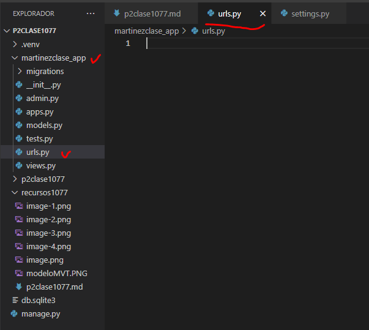
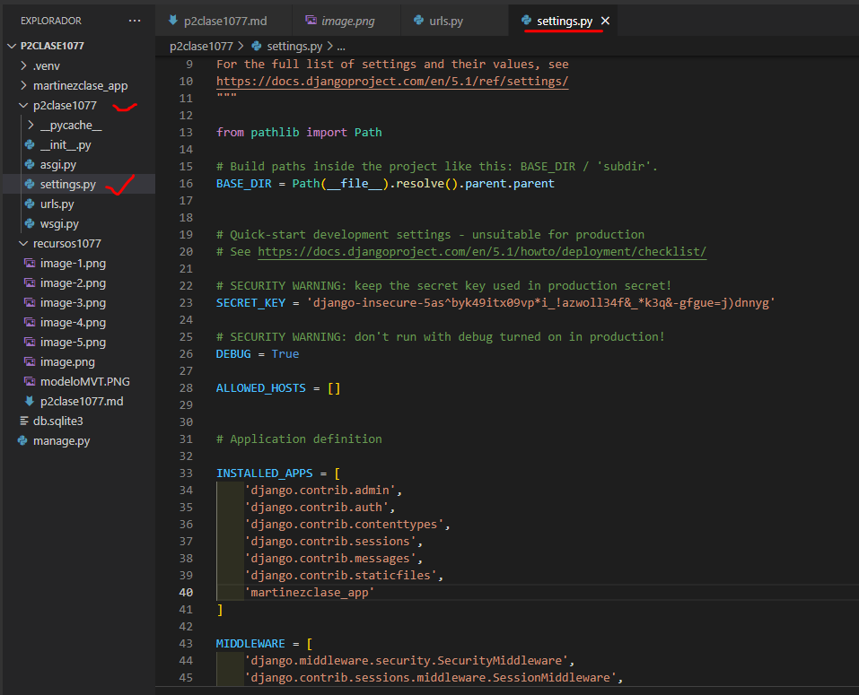
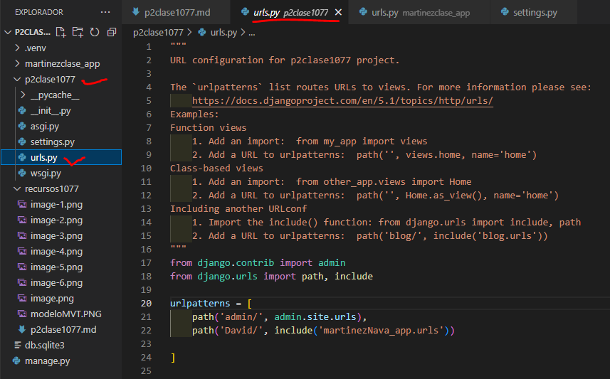
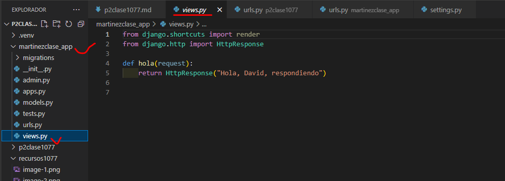
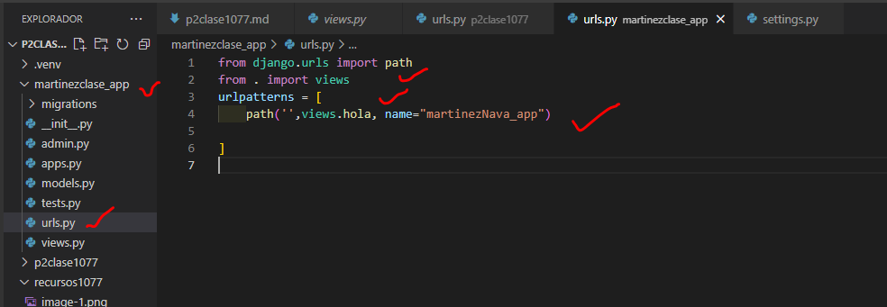

Crear aplicación MartinezNava_app
comando --> python manage.py startapp MartinezNava_app
- Creamos el archivo urls.py en MartinezNava_app
- 
- En settings.py de p2clase1077
- 
- En urls.py de p2clase1077
- 
- en urls.py en martinezNava_app
- 
- en views.py en martinezNava_app
- 
- En urls.py en martinezNava_app
- 